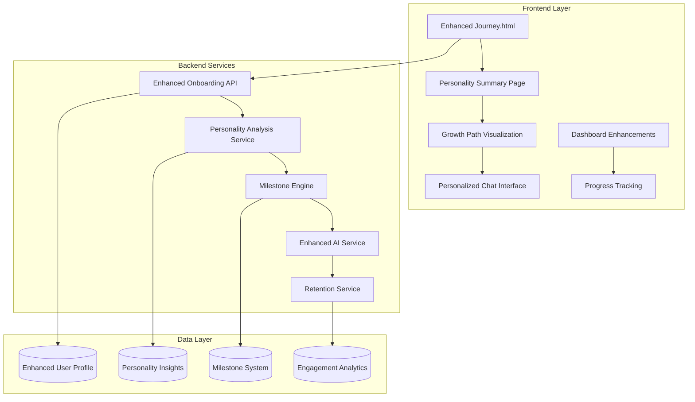

# Design Document

## Overview

The Enhanced Onboarding & First Session Experience design builds upon Solace's existing architecture to create an immediate, deeply personal connection that drives user retention past the critical 30-day cliff. The design focuses on transforming the current 13-question onboarding flow into a rapid, engaging experience that delivers instant personality insights, visible growth paths, and hyper-personalized first interactions.

The design leverages Solace's existing Node.js/Express backend, SQLite database, OpenAI GPT-4 integration, and personalization services while adding new components for personality analysis, milestone tracking, and enhanced user experience flows.

## Architecture

### System Architecture Overview



### Enhanced Data Flow

1. **Rapid Onboarding Flow**: User completes 13 questions in under 2 minutes
2. **Instant Analysis**: Personality analysis generates immediate insights
3. **Growth Path Display**: 5-stage relationship journey visualization
4. **Personalized Welcome**: AI generates hyper-personalized first message
5. **Milestone Achievement**: First session milestone and progress tracking
6. **Retention Hooks**: Intelligent reminder system based on user patterns

## Components and Interfaces

### 1. Enhanced Onboarding Service

**Purpose**: Processes questionnaire responses and generates instant personality insights

**Key Methods**:
```javascript
class EnhancedOnboardingService {
    async analyzePersonality(answers)
    async generatePersonalityInsights(profile)
    async createGrowthPath(userId, profile)
    async generatePersonalizedWelcome(profile)
    async initializeUserJourney(userId, profile)
}
```

**Integration Points**:
- Extends existing `/api/onboarding` endpoint
- Integrates with PersonalizationService for memory creation
- Connects to MilestoneEngine for achievement tracking

### 2. Personality Analysis Engine

**Purpose**: Transforms questionnaire responses into actionable personality insights

**Core Components**:
- **Communication Style Analyzer**: Determines preferred interaction patterns
- **Emotional Needs Detector**: Identifies primary emotional requirements
- **Coping Strategy Mapper**: Understands stress management preferences
- **Uniqueness Generator**: Creates personalized "what makes you unique" insights

**Analysis Framework**:
```javascript
const personalityFramework = {
    communicationStyles: {
        gentle: "Prefers soft, nurturing interactions",
        direct: "Values honest, straightforward communication", 
        casual: "Enjoys relaxed, friendly conversations",
        deep: "Loves meaningful, philosophical discussions"
    },
    emotionalNeeds: {
        validation: "Needs to feel heard and understood",
        clarity: "Seeks direction and clear guidance",
        connection: "Desires to feel less alone",
        growth: "Wants to develop better coping strategies"
    },
    copingStyles: {
        social: "Processes emotions through conversation",
        independent: "Prefers to work through challenges alone",
        active: "Uses physical activities for emotional regulation",
        avoidant: "Tends to avoid difficult emotions"
    }
}
```

### 3. Milestone Engine

**Purpose**: Tracks user progress and celebrates achievements to drive engagement

**Milestone Categories**:
- **Onboarding Milestones**: First assessment, first chat, profile completion
- **Engagement Milestones**: Daily streaks, conversation depth, emotional openness
- **Growth Milestones**: Relationship stage progression, emotional insights, coping improvements
- **Connection Milestones**: Trust building, vulnerability sharing, companion bonding

**Database Schema Enhancement**:
```sql
-- Enhanced milestones table
ALTER TABLE user_milestones ADD COLUMN category TEXT;
ALTER TABLE user_milestones ADD COLUMN points INTEGER DEFAULT 0;
ALTER TABLE user_milestones ADD COLUMN unlock_criteria TEXT;
ALTER TABLE user_milestones ADD COLUMN celebration_message TEXT;

-- New user progress tracking
CREATE TABLE user_progress (
    id INTEGER PRIMARY KEY AUTOINCREMENT,
    user_id INTEGER,
    current_stage TEXT DEFAULT 'getting_to_know',
    stage_progress INTEGER DEFAULT 0,
    next_milestone TEXT,
    engagement_score INTEGER DEFAULT 0,
    last_activity DATETIME,
    FOREIGN KEY (user_id) REFERENCES users (id)
);
```

### 4. Enhanced AI Service Integration

**Purpose**: Extends existing AIService with onboarding-specific capabilities

**New Methods**:
```javascript
class EnhancedAIService extends AIService {
    async generatePersonalityInsights(answers)
    async createPersonalizedWelcome(profile, insights)
    async generateFirstSessionPrompts(profile)
    async adaptResponseToOnboardingData(message, profile, stage)
}
```

**Personality-Driven Response System**:
- Dynamic system prompts based on questionnaire responses
- Adaptive communication style matching user preferences
- Context-aware emotional support based on identified needs
- Progressive relationship building through conversation stages

### 5. Retention & Engagement Service

**Purpose**: Implements intelligent reminder system and engagement tracking

**Key Features**:
- **Smart Notifications**: Context-aware reminders based on user patterns
- **Engagement Analytics**: Tracks user behavior and identifies drop-off risks
- **Re-engagement Flows**: Personalized messages for returning users
- **Crisis Detection**: Identifies users needing additional support

**Notification Framework**:
```javascript
const notificationTriggers = {
    firstSession: { delay: '24-48 hours', personalized: true },
    weeklyCheckIn: { condition: 'active_user', personalized: true },
    milestoneReminder: { trigger: 'progress_stall', motivational: true },
    reEngagement: { condition: 'inactive_7_days', empathetic: true }
}
```

## Data Models

### Enhanced User Profile Schema

```sql
-- Enhanced users table
ALTER TABLE users ADD COLUMN personality_insights TEXT;
ALTER TABLE users ADD COLUMN communication_preferences TEXT;
ALTER TABLE users ADD COLUMN emotional_profile TEXT;
ALTER TABLE users ADD COLUMN onboarding_completion_time DATETIME;
ALTER TABLE users ADD COLUMN first_session_completed INTEGER DEFAULT 0;

-- New personality insights table
CREATE TABLE personality_insights (
    id INTEGER PRIMARY KEY AUTOINCREMENT,
    user_id INTEGER,
    insight_type TEXT, -- 'communication_style', 'emotional_needs', 'coping_style', 'uniqueness'
    insight_content TEXT,
    confidence_score REAL,
    display_priority INTEGER,
    created_at DATETIME DEFAULT CURRENT_TIMESTAMP,
    FOREIGN KEY (user_id) REFERENCES users (id)
);

-- Enhanced companion settings
ALTER TABLE companion_settings ADD COLUMN onboarding_based_personality TEXT;
ALTER TABLE companion_settings ADD COLUMN growth_stage_preferences TEXT;
ALTER TABLE companion_settings ADD COLUMN milestone_celebration_style TEXT;
```

### Engagement Analytics Schema

```sql
CREATE TABLE engagement_analytics (
    id INTEGER PRIMARY KEY AUTOINCREMENT,
    user_id INTEGER,
    session_start DATETIME,
    session_end DATETIME,
    messages_sent INTEGER,
    emotional_depth_score REAL,
    milestone_achieved TEXT,
    retention_risk_score REAL,
    next_engagement_prediction DATETIME,
    FOREIGN KEY (user_id) REFERENCES users (id)
);
```

## Error Handling

### Graceful Degradation Strategy

1. **AI Service Failures**: Fallback to rule-based personality analysis
2. **Database Connectivity Issues**: Local storage backup for critical onboarding data
3. **Personality Analysis Errors**: Default to balanced, adaptive communication style
4. **Milestone System Failures**: Continue core functionality without achievement tracking

### Error Recovery Patterns

```javascript
class ErrorRecoveryService {
    async handleOnboardingFailure(userId, answers) {
        // Save answers locally, retry analysis
        // Provide basic personality insights
        // Enable manual completion later
    }
    
    async handleAIServiceFailure(message, profile) {
        // Use enhanced rule-based responses
        // Reference onboarding data directly
        // Maintain personalization without AI
    }
}
```

## Testing Strategy

### Unit Testing Focus Areas

1. **Personality Analysis Accuracy**: Validate insight generation from questionnaire responses
2. **Milestone Trigger Logic**: Ensure proper achievement detection and celebration
3. **AI Integration**: Test personalized response generation with various personality profiles
4. **Retention Logic**: Validate notification timing and personalization

### Integration Testing Scenarios

1. **Complete Onboarding Flow**: End-to-end user journey from questions to first chat
2. **Cross-Service Communication**: Personality service → AI service → milestone engine
3. **Database Consistency**: Ensure data integrity across enhanced schema
4. **Fallback Mechanisms**: Test graceful degradation under various failure conditions

### User Experience Testing

1. **Onboarding Speed**: Validate 2-minute completion target
2. **Personality Accuracy**: User validation of generated insights
3. **First Session Impact**: Measure immediate value perception
4. **Retention Effectiveness**: Track 7/30/90-day retention improvements

## Performance Considerations

### Optimization Strategies

1. **Personality Analysis Caching**: Cache common personality patterns
2. **AI Response Optimization**: Pre-generate common welcome message templates
3. **Database Indexing**: Optimize queries for user insights and milestones
4. **Frontend Performance**: Lazy load non-critical onboarding components

### Scalability Planning

1. **Horizontal Scaling**: Stateless service design for easy scaling
2. **Database Sharding**: Partition user data by registration date
3. **CDN Integration**: Cache static personality framework content
4. **Background Processing**: Async personality analysis for large user volumes

## Security & Privacy

### Enhanced Privacy Controls

1. **Local Data Encryption**: Encrypt personality insights at rest
2. **Granular Consent**: Separate consent for personality analysis vs. AI personalization
3. **Data Portability**: Export personality insights and onboarding data
4. **Right to Deletion**: Complete removal of personality profile and derived insights

### Security Measures

1. **Input Validation**: Sanitize all questionnaire responses
2. **Rate Limiting**: Prevent onboarding abuse and spam
3. **Session Security**: Secure token handling during onboarding flow
4. **Audit Logging**: Track personality data access and modifications

## Implementation Phases

### Phase 1: Core Onboarding Enhancement (Week 1-2)
- Enhanced questionnaire UI with progress indicators
- Personality analysis engine implementation
- Basic milestone system integration
- Immediate personality insights display

### Phase 2: AI Integration & Personalization (Week 3-4)
- Enhanced AI service with personality-driven responses
- Personalized welcome message generation
- Growth path visualization
- First session milestone implementation

### Phase 3: Retention & Analytics (Week 5-6)
- Intelligent notification system
- Engagement analytics tracking
- Re-engagement flow implementation
- Performance optimization and testing

### Phase 4: Advanced Features & Polish (Week 7-8)
- Crisis support integration
- Advanced milestone categories
- Privacy controls enhancement
- Comprehensive testing and refinement